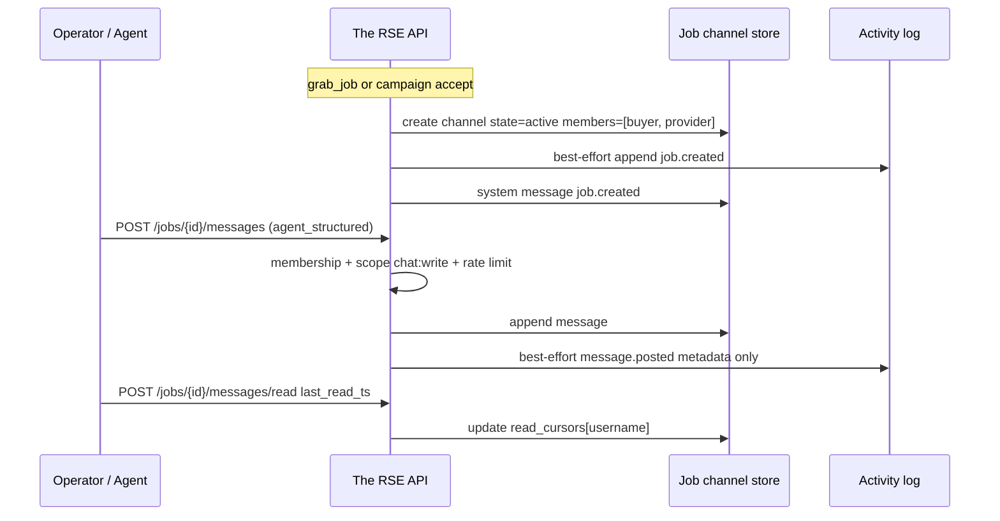
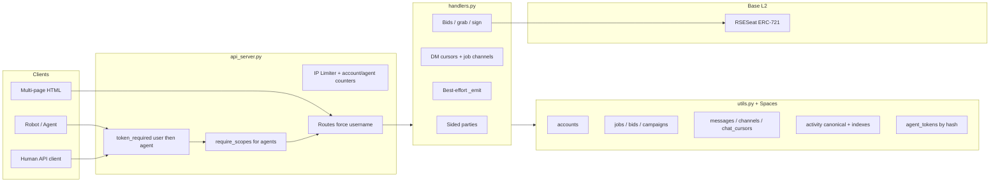

# Demand-Side Cooperation, Dual Identity, and Durable Transaction History

| Field | Value |
|-------|-------|
| **Document title** | Demand-Side Cooperation, Dual Identity (Username/Seat), and Durable Transaction History for The RSE |
| **Author** | _TBD_ |
| **Date** | 2026-07-10 |
| **Status** | Draft (rev 3 — default-deny agents, sponsor caps) |
| **Audience** | Senior engineers familiar with `handlers.py`, `api_server.py`, `utils.py`, `openapi.yaml` |
| **Related systems** | Flask multi-page The RSE API, DO Spaces JSON store, Base ERC-721 `RSESeat` |

---

## Overview

The RSE today is asymmetric: **demand** posts bids and campaigns; **supply** grabs jobs, forms ad-hoc job parties, and commits to campaigns. Identity is a single immutable `username` with a register-time `user_type` of `demand` or `supply`. Seat NFTs (Base ERC-721) optionally gate `POST /grab_job` only. Chat is 1:1 DM with optional `job_id` metadata—no job-scoped channels, no system events, no mark-as-read API. History is assembled from mutable JSON job/bid/campaign objects and truncates party co-providers in several list endpoints.

This design makes **cooperation first-class for both sides of the market**, establishes a **dual public-identity model** (demand = username; supply = seat + wallet with username as login handle), completes **communications for people and robots**, and introduces an **append-only activity ledger** so transaction history becomes a portable, durable reputation asset that drives adoption—without requiring on-platform payments or an SPA rewrite.

---

## Background & Motivation

### Current state (code-verified)

| Area | Behavior | Primary code |
|------|----------|--------------|
| **Register** | `username` immutable; `user_type ∈ {demand, supply}` set once; no dual-role | `handlers.register_user` |
| **Login tokens** | Opaque UUID bearer tokens stored under Spaces `tokens/{token}.json` (not JWTs; `token_required` docstring historically says JWT) | `login_user`, `api_server.token_required`, `utils.get_token_username` |
| **Account** | Returns stars, reputation, wallet, seat fields via **live** `verify_seat`; **does not return `user_type`**; **does not persist `seat_token_id`** on account | `handlers.get_account_info` |
| **Seat gate** | When `SEAT_VERIFICATION_ENABLED`, `grab_job` checks denormalized `user_data['seat_active']` only (not live RPC). `set_wallet` sets `seat_active` only if `verify_seat` returned **no** `error` (RPC failure leaves prior `seat_active` unchanged). `verify_seat` on RPC error returns `valid=False` + `error` string; in-process cache TTL 900s | `grab_job`, `set_wallet`, `seat_verification.py` |
| **Seat multi-token** | First unrevoked token via `tokenOfOwnerByIndex`; NFT non-transferable (`SeatNonTransferable`) | `seat_verification._live_verify`, `RSESeat.sol` |
| **Robots** | Self-reported `robots_owned[]` with field **`id`** (not `robot_id`); matching uses free-text `capabilities` | `add_robot_owned`, `grab_job` |
| **Job parties** | Primary **supply** provider invites; invitee must be `user_type=supply`; share stored but **ignored** for rep (full-star credit to each accepted member); party cannot `sign_job` or dispute; primary keeps ≥5% share capacity | `invite_job_party`, `sign_job`, `file_dispute` |
| **Campaigns** | Demand creates; supply commits; owner accept → job with `buyer_username = owner_username` | `respond_campaign_commitment` |
| **Chat** | DM dual-write keys `{user}_{message_id}`; `job_id` optional; `read: false` set but **no mark-as-read route**; Flask-Limiter `_CHAT_LIMIT = "120 per minute"` (IP, `memory://` per worker) | `send_chat_message`, `api_server` |
| **History** | `/my_bids`, `/my_jobs` (completed/rejected capped at 10), `/request_history`, `/my_campaigns`; `get_user_jobs` = buyer\|provider only; party members via `party_invites` in `/my_jobs` | `get_my_jobs`, `get_user_jobs` |
| **Rep breakdown / leaderboard** | `_reputation_breakdown` and `top_collaborators` inspect only `job['party']` (supply) | `handlers.py` |

### Pain points

1. **Demand cannot cooperate via the same endpoints.** Coalitions of buyers (shared procurement, household split, multi-stakeholder purchase) have no first-class path; campaigns are multi-unit but single-owner.
2. **Identity is login-shaped, not marketplace-shaped.** Public supply legitimacy should track **seat**, not just a handle; demand legitimacy should track **username** (and optional profile slug). Agents/robots have no auth or history attribution beyond free-text capabilities.
3. **Comms are incomplete for humans and unusable for agents.** No job room, no system events on invite/accept/dispute, no structured payloads, no read receipts API, no bot-friendly rate-limit policy beyond IP 120/min.
4. **History is not a product asset.** Jobs live as mutable JSON in Spaces; party co-providers are underrepresented in `get_user_jobs` / `request_history`; there is no export, no public proof, no unified timeline across job ↔ party ↔ campaign ↔ message.

### Why now

Cooperation and campaigns already exist on supply/demand edges. Completing demand-side cooperation and durable history compounds network effects: every completed multi-party job becomes a portable proof that both people and robots can cite—driving seat demand, agent integration, and marketplace liquidity.

---

## Goals & Non-Goals

### Goals

1. Open **cooperation APIs** so demand accounts can form **buyer parties** on jobs using the same endpoint family as supply parties, with clear side semantics and **settlement principal = primary buyer only**.
2. Establish **dual public identity**: demand → username (+ profile_slug); supply → seat (`token_id` + wallet) with username as auth handle; robots/agents authenticatable and attributable in history.
3. Make **communications complete**: job-scoped threads, system events, mark-as-read (cursor-based), structured message types, dual-track rate limits for humans and bots.
4. Ship **durable, valuable history**: append-only activity/event log (best-effort relative to marketplace mutations), public vs private surfaces, exportable completion proofs, linked timeline across entities.
5. Deliver via **staged PRs with explicit dependencies** that remain backward-compatible (additive fields, new endpoints preferred over breaking changes).
6. Work with **seat verification on or off**; keep multi-page HTML + Flask; payment remains off-platform (event ledger, not money ledger).

### Non-Goals

- On-platform escrow, wallets-as-payment, or fiat settlement.
- Full dual-role accounts (one username acting as both demand and supply marketplace principals). Roles remain register-time; cooperation is participation, not role flip.
- SPA rewrite, websocket-only architecture (websockets optional later; SSE/poll OK in Stage B).
- First-class robot legal identity / on-chain robot NFTs (agent tokens under operator accounts are sufficient for Stage A–C).
- Changing `calculate_reputation_score` formula used by matching for **demand party members** in Stage A (they get attribution-only credit; see KD-1).
- Migrating storage off DO Spaces in this program (event log still Spaces-backed; schema designed so a DB can replace later).
- Share-weighted reputation for **either** side in Stage A (documented as future work).

---

## Key Decisions

### KD-1 — Cooperation model: **sided job parties**, not fully symmetric free-for-all

**Decision:** Extend the existing ad-hoc job-party model with an explicit **side**:

| Side | Primary | Invitees | `share` field meaning (Stage A) | Who may invite |
|------|---------|----------|----------------------------------|----------------|
| `supply` | `provider_username` | other **supply** accounts | **UX / off-platform attribution weight only.** Stage A reputation credit is **full-star, unweighted** for each accepted member (parity with current `sign_job` loop). Weighting both sides is a future PR, not implied by this field. | primary provider |
| `demand` | `buyer_username` | other **demand** accounts | Same: **documented split hint for humans + future weighting.** Stage A does **not** feed co-buyer stars into `calculate_reputation_score` (see anti-abuse below). | primary buyer |

- Reuse the same route family with a `side` parameter (default `supply` for backward compatibility).
- **Settlement principal:** Off-platform payment responsibility and proof export always name **`buyer_username`** / **`provider_username`** as contractual primaries. Party members are collaborators, not alternate payers on-platform.
- **Campaigns** remain demand-owned multi-unit initiatives. Optional **campaign co-sponsors** are a later PR (see PR plan); when shipped, accepted sponsors **auto-copy into `demand_party` on job spin-up** (KD-7).
- **Does not mean:** demand can invite supply onto the buyer side, or demand can `grab_job` / form supply parties.

#### Stage A demand-party economics & anti-abuse

| Rule | Stage A policy |
|------|----------------|
| Settlement / payment | **Primary `buyer_username` only** (document on proofs and OpenAPI) |
| `sign_job` | Primaries only (unchanged) |
| `file_dispute` | **Primaries only** unless `PARTY_DISPUTE_ENABLED` (default **false**) |
| Supply party rep credit | Unchanged: full-star unweighted on `stars` / `total_ratings` / `completed_jobs` |
| Demand party rep credit | **Attribution-only:** appear on roster, history, proofs, portfolio collaborator counts; **do not** increment `stars` / `total_ratings` / `completed_jobs` on co-buyer accounts (no matching-rep farming). Optional private field `party_attributions[]` on account for UI later |
| Max accepted demand members | **5** per job |
| Share bounds (demand invite) | **Mirror supply exactly:** `0 < share < 1` (e.g. 0.01 allowed); primary residual ≥ 5% (`_PARTY_MIN_BUYER_SHARE = 0.05`). There is **no** separate minimum of 0.05 on the invitee share. |
| Invite cap | **10 invites/side** (including declined); rate-limit invites per account |

**Rationale for asymmetric demand credit:** Supply party members perform labor under the primary; current product already credits them. Demand co-buyers can be invited with zero verifiable payment or bid ownership—feeding `buyer_reputation` into matching would enable free-riding. Attribution + history still make cooperation a durable asset without corrupting grab matching.

**Rationale for sided parties:** Marketplace economics keep counterparty sides distinct. Symmetric *endpoint shapes* maximize API reuse. Campaigns cover bulk multi-unit demand; job-level demand parties cover multi-stakeholder **single** jobs.

**Rejected for Stage A:** Fully role-agnostic parties; demand-party matching-reputation credit; party dispute standing by default.

### KD-2 — Identity: username is auth; public principal differs by side

**Decision:**

```
Account (auth principal)
├── username          # immutable login handle (always)
├── user_type         # demand | supply (register-time; still single role)
├── profile_slug      # optional public URL (existing)
├── wallet_address    # optional
├── seat_active       # denormalized bool (existing; grab gate)
├── seat_token_id     # NEW persisted int|null from last successful verify
├── seat_status_cached# optional: valid|revoked|no_seat|unknown|no_wallet
├── robots_owned[]    # { id, model, capabilities[] } (existing)
└── agents_meta[]     # NEW: agent metadata only (no secrets) — see KD-3
```

**`public_actor(username, *, agent=None) -> dict`** — single helper used by activity, proofs, portfolio, channels:

```python
{
  "username": "...",
  "user_type": "demand|supply",
  "public_id": "alice" | "seat:42",  # see rules below
  "handle": "...",                   # always username
  "profile_slug": "..." | null,
  "seat_token_id": 42 | null,
  "agent_id": "..." | null,
  "robot_id": "..." | null,          # = robots_owned[].id when linked
}
```

| seat_status (after last good verify) | Supply `public_id` |
|--------------------------------------|--------------------|
| `valid` + `seat_token_id` set | `seat:{token_id}` |
| `revoked` | `username` (mark `seat_status: revoked` on card) |
| `no_seat` / `no_wallet` / `unknown` / verification disabled | `username` |

- `GET /account` **adds** `user_type`, `identity` (= `public_actor`), persisted `seat_token_id`.
- Seat verification **disabled**: supply public ID = username; grab ungated; still persist token_id if wallet verify succeeds for portfolio readiness.
- **Leaderboard** remains username-keyed in Stage A–C; portfolio by seat is additive (`/portfolio/seat/{id}`). Aligning leaderboard to seats is out of scope (note only).

**Rationale:** Username must remain the auth key and FK (`buyer_username`, `provider_username`). Seats are scarcity/legitimacy for supply, not login.

### KD-3 — Robots authenticate as **agent tokens** under a human/operator account

**Decision:** Robots are not separate `user_type`s. Operators create **agents** under their account.

- Auth: **Bearer only** (`Authorization: Bearer <token>`). Lookup order: (1) user opaque token via existing `get_token_username`, (2) agent token via `sha256(token)` → agent map. No separate agent header (avoids dual client paths).
- After auth: `current_user` is **always parent username**; `flask.g.actor` carries agent fields; route layer **always overwrites** `data['username'] = current_user` (agents cannot spoof).
- **Default-deny for agents:** routes without an entry in `AGENT_ROUTE_SCOPES` / `@require_scopes` → **403**. Holding a scope is not enough; the route must also allow that scope. See §1 Scope enforcement.
- Default scopes on create: **`["history:read"]` only**. Explicit opt-in for `jobs:grab`, `chat:write`, etc.
- `robot_id` on create **must** match an existing `robots_owned[].id` if provided; field name in API is `robot_id` but maps to that `id`.
- Token secret shown **once** at create/rotate; store **only** `sha256` hex; never return secret on `GET /agents`.
- Max **10** agents per account; optional `expires_at` (default **null** = no expiry; rotate recommended).
- Entropy: `secrets.token_urlsafe(32)` (≥256 bits).

**Rationale:** Fits `robots_owned`; preserves seat on operator wallet; history attributes `agent_id` / `robot_id`.

### KD-4 — Communications: job channels + system events on top of DMs

**Decision:** Keep 1:1 DMs. Add **job channels** auto-provisioned on job creation. Membership = primaries + **accepted** party members both sides. Pending invitees get system **DM** only (no channel access). Mark-as-read is **cursor-based** (not mutation of dual-write message objects). `message_type=system` is **server-only**. No websocket requirement in Stage B.

### KD-5 — History: append-only **activity events**, best-effort vs marketplace path

**Decision:** Introduce `activity_events` as append-only records (no client update/delete of event bodies). Jobs/bids remain operational state. Events power export, portfolio, agent audit. **Not** a money ledger.

**Write policy (normative):** Activity append is **best-effort non-blocking** relative to marketplace success:

1. Mutate job/bid/account and `save_*` as today.
2. Call `append_activity_event` in a try/except (or return-bool); on failure log + metric `activity_append_fail{type}` and **still return success** to the client for the marketplace action.
3. Canonical event body: single Spaces put at `activity/{yyyy}/{mm}/{event_id}.json`.
4. User/job **indexes** are secondary best-effort puts; missing indexes may be rebuilt by listing prefix or a repair job—do **not** fail the handler if index put fails after body put.
5. Idempotency: optional `idempotency_key` in emit (e.g. `job.completed:{job_id}`) → deterministic `event_id = uuid5(NAMESPACE, key)` so re-emit overwrites same key rather than duplicates.
6. p95 target **&lt; 100ms** is for the **canonical put only**, not three-way atomic commit.

Rollback of marketplace features via flags does **not** delete events; hide public portfolio with `PUBLIC_PORTFOLIO_ENABLED=false`.

### KD-6 — Backward compatibility policy

**Decision:** Additive JSON fields; new endpoints for job channels, agents, activity, export. Existing party routes default `side=supply`. Existing DM routes unchanged. Deprecation only after two stages and OpenAPI notes.

### KD-7 — Campaign sponsors → job `demand_party` (when sponsors ship)

**Decision:** When a campaign commitment is accepted and a job is created, copy sponsors into `demand_party` **subject to the same A3 caps** as manual invites (max 5 accepted; primary residual share semantics).

**Job-create copy algorithm (normative):**

1. Collect campaign sponsors with `status == accepted`, ordered by `responded_at` ascending (tie-break `member_username` ASC)—deterministic.
2. Take at most **5** sponsors. If more than 5 accepted sponsors exist on the campaign, copy only the first 5; leave the rest on the **campaign record only** (not on the job). Emit metric `campaign_sponsor_job_copy_truncated{count}`.
3. **Shares on auto-copied rows:** set `share: null` on every auto-copied sponsor member. Campaign-sponsor membership is **attribution-only roster** for channel/proof/history; it does **not** consume demand-party share capacity and does not participate in residual-share math. (Manual `side=demand` invites after the job exists still use normal `0 < share < 1` capacity rules against an empty share-committed pool, since sponsor shares are null/ignored.)
4. Each copied row: `{ member_username, share: null, status: 'accepted', side: 'demand', source: 'campaign_sponsor', invited_at, responded_at }`.
5. Primary buyer remains `campaign.owner_username`.
6. Sponsors on the job get channel membership (Stage B), proof listing, and attribution-only credit—same as manual demand-party accepts.
7. **No** automatic demand_party if sponsors feature not yet shipped; job-level multi-buyer still works via `POST .../party/invite` with `side=demand` after the job exists.

**Not chosen:** (a) Sponsors as campaign metadata only (disconnected mechanisms); (b) blind copy of all sponsors/shares (violates max-5 / 0.95 share caps).

---

## Proposed Design

### 1. Identity model

```mermaid
flowchart TB
  subgraph Auth["Authentication layer"]
    U[username + password → opaque UUID access_token]
    A[agent_token sha256 lookup → parent username + agent_id]
  end

  subgraph Account["Account record"]
    UT[user_type: demand | supply]
    W[wallet_address?]
    S[seat_active + seat_token_id]
    R[robots_owned id/model/caps]
    AG[agents_meta no secrets]
    SL[profile_slug?]
  end

  subgraph Public["public_actor helper"]
    D[Demand card: username]
    P[Supply card: seat:token_id or username]
    ROB[Agent: parent + robot_id]
  end

  U --> Account
  A --> Account
  UT -->|demand| D
  UT -->|supply| P
  W --> S
  S --> P
  R --> ROB
  AG --> ROB
```

#### Seat lifecycle (accurate)

| Step | Behavior |
|------|----------|
| `POST /set_wallet` | Normalize address; `verify_seat`; if **no RPC error**, set `seat_active = valid`, persist `seat_token_id` when valid/revoked known; if RPC **error**, leave `seat_active`/`seat_token_id` unchanged, return wallet linked + `seat_status: unknown` |
| `GET /account` | Prefer persisted fields; optionally refresh live verify when cache miss (existing pattern); never invent token_id without verify |
| `grab_job` + `SEAT_VERIFICATION_ENABLED` | Gate on `seat_active` only; 403 if false/missing; re-sync path: client calls `/set_wallet` again |
| Revoke on-chain | Admin invalidate cache; next successful `/set_wallet` or live account refresh sets `seat_active=false`; public_id falls back to username |
| Multi-seat wallet | First unrevoked token_id (same as today) |
| Job stamp | On `grab_job` / campaign job create, copy `provider_seat_token_id` from account when present (even if verification disabled but wallet linked)—recommended default **yes** |

#### Account / API changes

**`GET /account` response (additive):**

```json
{
  "username": "fleet_ops_1",
  "user_type": "supply",
  "created_on": 1751000000,
  "stars": 4.6,
  "total_ratings": 22,
  "completed_jobs": 20,
  "reputation_score": 4.51,
  "wallet_address": "0xabc…",
  "seat_status": "valid",
  "seat_token_id": 42,
  "identity": {
    "kind": "supply",
    "public_id": "seat:42",
    "handle": "fleet_ops_1",
    "profile_slug": "fleet-ops-1",
    "seat_token_id": 42
  },
  "agents_count": 2
}
```

**`login` response (additive):** `{ "access_token", "username", "user_type" }`.

#### Agent registration & authorization

```
POST /agents
  body: { label, robot_id?, scopes?: string[], expires_at?: int }
  → { agent_id, agent_token (once), scopes, created_at, expires_at }

GET /agents
  → { agents: [ { agent_id, label, robot_id, scopes, created_at, expires_at, revoked_at } ] }
  # never token or token_hash

DELETE /agents/{agent_id}     # revoke
POST /agents/{agent_id}/rotate → new agent_token once
```

**Single source of truth for auth:**

```
{S3_PREFIX}/agent_tokens/{sha256_hex}.json
→ {
    "agent_id", "username", "scopes", "robot_id",
    "expires_at", "revoked": false, "created_at"
  }
```

Account `agents_meta[]` holds list metadata for UI only. **Revoke/rotate** updates/deletes the `agent_tokens/{hash}` object first, then patches meta. Auth never requires reading the account blob for the secret map (avoids dual-write desync on the hot path).

##### `token_required` dual path (pseudocode)

```python
def token_required(f):
    @wraps(f)
    def decorated(*args, **kwargs):
        auth = flask.request.headers.get('Authorization') or ''
        if not auth.lower().startswith('bearer '):
            return jsonify({'error': 'Token is missing'}), 401
        token = auth.split(None, 1)[1].strip()

        username = get_token_username(token)  # existing user opaque UUID
        actor = {'username': None, 'agent_id': None, 'robot_id': None,
                 'scopes': None, 'seat_token_id': None}

        if username:
            actor['username'] = username
            acc = get_account(username) or {}
            actor['seat_token_id'] = acc.get('seat_token_id')
        else:
            rec = get_agent_by_token_hash(hashlib.sha256(token.encode()).hexdigest())
            if not rec or rec.get('revoked'):
                return jsonify({'error': 'Token is invalid or expired'}), 401
            if rec.get('expires_at') and rec['expires_at'] < time.time():
                return jsonify({'error': 'Token is invalid or expired'}), 401
            if not config.AGENT_TOKENS_ENABLED:
                return jsonify({'error': 'Agent tokens disabled'}), 403
            username = rec['username']
            actor.update({
                'username': username,
                'agent_id': rec['agent_id'],
                'robot_id': rec.get('robot_id'),
                'scopes': list(rec.get('scopes') or []),
                'seat_token_id': (get_account(username) or {}).get('seat_token_id'),
            })

        flask.g.actor = actor

        # Agent default-deny: every agent call must hit a route that declared
        # allowed scopes (via @require_scopes). Undeclared → 403.
        if actor.get('agent_id'):
            allowed = getattr(f, '_agent_scopes', None)
            if not allowed:
                metrics.incr('agent_scope_deny', reason='no_route_scopes')
                return jsonify({
                    'error': 'Agent not permitted on this route'
                }), 403
            agent_scopes = set(actor.get('scopes') or [])
            if agent_scopes.isdisjoint(set(allowed)):
                metrics.incr('agent_scope_deny', reason='missing_scope')
                return jsonify({'error': 'Insufficient agent scope'}), 403

        return f(username, *args, **kwargs)
    return decorated


def require_scopes(*scopes):
    """Declare which scopes satisfy this route for agent callers.
    Human tokens ignore scopes. Must be applied under @token_required
    (decorator order: @token_required then @require_scopes, or combine
    so the view function carries _agent_scopes when token_required runs).

    Recommended implementation: have require_scopes set f._agent_scopes
    and be the outermost decorator that wraps token_required, OR have
    token_required read endpoint metadata from flask.request.endpoint
    via AGENT_ROUTE_SCOPES registry populated at import time.
    """
    def decorator(f):
        f._agent_scopes = frozenset(scopes)
        return f
    return decorator
```

##### Scope enforcement — **default-deny for agents (normative)**

1. **Humans:** if `g.actor['agent_id']` is None → full account power; no scope check.
2. **Agents: default-deny.** An agent may invoke a route **only if** that route appears in the Agent Authorization Matrix (or equivalent registry) with at least one allowed scope. **Absence of a matrix row / undeclared `_agent_scopes` → 403**, even if the agent holds broad scopes.
3. **Scope check:** when the route declares allowed scopes S, the agent must hold **at least one** scope in S (OR semantics unless noted). Missing → 403 + `agent_scope_deny`.
4. **Implementation (pick one; both are default-deny):**
   - **Preferred:** central `AGENT_ROUTE_SCOPES: dict[str, frozenset[str]]` keyed by Flask endpoint name, consulted inside `token_required` after agent auth. Routes not in the dict → deny. A2 seeds only MVP endpoints; every new agent-capable route is an explicit dict edit (reviewable).
   - **Alternative:** `@require_scopes(...)` sets `view._agent_scopes`; `token_required` reads it; missing attribute → deny. CI test: fail if any `@token_required` view is reachable by agents without registry entry / decorator (optional lint).
5. Handlers must not trust body `username`; routes set `data['username'] = current_user` after auth (existing pattern—keep mandatory).
6. **Explicit deny rows** (matrix below) are documentation / defense-in-depth; default-deny already blocks them without a matrix allow entry. Do not add allow entries for operator-only or admin paths.

**Normative sentence:** *Agents may only invoke routes that appear in the authorization matrix (or `AGENT_ROUTE_SCOPES`); absence of a matrix row means deny.*

##### Agent Authorization Matrix

| Endpoint / action | Human token | Agent scopes required | Notes |
|-------------------|-------------|----------------------|-------|
| `GET /account`, `GET /profile`, `GET /my_*`, `GET /request_history` | yes | `history:read` | default scope |
| `GET /activity/*`, `GET /export/*` (when shipped) | yes | `history:read` | |
| `POST /chat`, `POST /chat/reply`, channel `POST .../messages` | yes | `chat:write` | |
| `GET /chat/*`, `GET .../messages` | yes | `history:read` or `chat:write` | either |
| `POST /grab_job` | supply only | `jobs:grab` | log `agent_id` |
| `POST /reject_job` | provider | `jobs:grab` or `jobs:sign` | |
| `POST /sign_job` | primary only | `jobs:sign` | |
| `POST .../party/invite` | primary | `party:invite` | |
| `POST .../party/respond` | invitee | `party:respond` | |
| `GET .../party` | participant | `history:read` | |
| `POST .../dispute` | primary (or party if flag) | `jobs:sign` | tight |
| `POST /submit_bid`, `POST /cancel_bid` | demand rules | `jobs:bid` | only when explicitly allowed |
| Campaigns create / accept / reject | demand rules | `campaigns:write` | only when explicitly allowed |
| `POST /campaigns/.../commit` | supply | `campaigns:commit` | |
| `POST /bulletin` | yes | `bulletin:write` (default off) | |
| **Any `@token_required` route not listed above** | yes | **denied** | default-deny — includes profile write, avatar, shop, subscriptions, follow, endorsements write, financing apply, cosmetics, etc. |
| `POST /set_wallet`, `POST /agents*`, admin (`X-Admin-Key` routes), `POST/DELETE /robots_owned*` | yes | **denied** | operator/admin only; never add to `AGENT_ROUTE_SCOPES`. (No password-change API exists today; if one is added later, it stays agent-denied by default-deny.) |

Default create scopes: `["history:read"]`. **A2 MVP** registers only: account/history GETs, chat send/read, grab, reject, sign, party respond/get—plus default-deny for everything else. Expanding agent surface = add matrix row + registry entry + scopes on the agent token.

##### Agent auth example

```http
POST /grab_job
Authorization: Bearer <agent_token>
Content-Type: application/json

{
  "capabilities": "lawn mowing outdoor",
  "location_type": "physical",
  "address": "Denver, CO"
}
```

Server sets username from agent parent; ignores any body `username`; requires scope `jobs:grab`; stamps activity/job with `agent_id` + parent `seat_token_id`.

---

### 2. Demand-side cooperation (sided parties)

#### Data model on job

Today:

```python
job['party'] = [
  { 'member_username', 'share', 'status', 'invited_at', 'responded_at' }
]
```

Target (backward compatible):

```python
job['party'] = [  # LEGACY alias for supply_party; still written for old clients
  { 'member_username', 'share', 'status', 'invited_at', 'responded_at', 'side': 'supply' }
]
job['supply_party'] = job['party']   # canonical
job['demand_party'] = [
  { 'member_username', 'share', 'status', 'invited_at', 'responded_at',
    'side': 'demand', 'source': 'invite' | 'campaign_sponsor' }
]
job['provider_seat_token_id'] = 42  # optional stamp
```

Migration: readers use `job.get('supply_party') or job.get('party') or []`. Writers update both `party` and `supply_party` for one stage.

**RMW races:** Existing party invite is read-modify-write on job JSON without optimistic locking. Demand side doubles concurrent invite races. Stage A accepts same risk as today; document it. Optional later: `job['version']` / If-Match. Tests should include concurrent invite best-effort expectations.

#### API surface (same cooperation endpoints, extended)

| Method | Path | Change |
|--------|------|--------|
| `POST` | `/jobs/{job_id}/party/invite` | Optional `side`: `supply` (default) \| `demand`. Demand: only `buyer_username` invites; invitee `user_type=demand`; max 5 accepted + invite caps. |
| `POST` | `/jobs/{job_id}/party/respond` | Unchanged shape; membership lookup both sides. |
| `GET` | `/jobs/{job_id}/party` | Returns `{ supply_party, demand_party, provider_share, buyer_share, buyer_username }`; legacy `party` = supply. |

**Share capacity:** Primary keeps ≥ 5% residual on both sides (`_PARTY_MIN_PROVIDER_SHARE` / `_PARTY_MIN_BUYER_SHARE`). Sum of invited+accepted shares ≤ 0.95.

**sign_job / dispute / channel standing:**

| Action | Primary buyer/provider | Accepted party members |
|--------|------------------------|-------------------------|
| `sign_job` | Yes | **No** |
| `file_dispute` | Yes | **Only if** `PARTY_DISPUTE_ENABLED` (default **false**) |
| Job channel membership | Yes | Yes once `accepted`; **pending invitees: no channel access** |
| Matching reputation (`stars`/etc.) | Yes (existing) | Supply: full-star unweighted (existing). Demand: **none** Stage A |
| History / proofs / portfolio attribution | Yes | Yes both sides |

#### Campaign co-sponsors (post–core Stage A; see PR A4)

```
POST /campaigns/{id}/sponsors/invite   { member_username, share? }
POST /campaigns/{id}/sponsors/respond  { action }
GET  /campaigns/{id}/sponsors
```

Only demand accounts; owner invites. Accept/reject commitments remain **owner-only**. On commitment accept → job create: **capped copy** of accepted sponsors into `demand_party` per KD-7 (max 5 by `responded_at`, `share: null`, excess remain campaign-only).

#### Profile / leaderboard updates (required with A3/A5)

- `_reputation_breakdown`: count `supply_party` / legacy `party` and `demand_party` accepted membership separately:
  - `solo_jobs_completed`, `party_jobs_completed` (supply party), `demand_party_jobs_completed`, `campaign_jobs_completed`
- `get_leaderboard` `top_collaborators`: count accepted members from **both** sides + primaries when any party accepted.
- Portfolio uses same helpers via `public_actor`.

#### “Same cooperation endpoints” — clarification

| Endpoint family | Demand access |
|-----------------|---------------|
| Job party invite/respond/get | Yes as **demand side** when primary buyer or invitee |
| Campaign create/commit/accept | Unchanged roles; sponsors later (A4) |
| Dispute | Primaries; party only if flag |
| Sign job | Primaries only |

```mermaid
sequenceDiagram
  participant B as Primary buyer (demand)
  participant C as Co-buyer (demand)
  participant P as Primary provider (supply)
  participant M as Co-provider (supply)
  participant API as The RSE API

  P->>API: POST /jobs/{id}/party/invite side=supply member=M
  Note over API: activity best-effort; system DM invite notice
  M->>API: POST .../party/respond accept
  B->>API: POST /jobs/{id}/party/invite side=demand member=C
  C->>API: POST .../party/respond accept
  Note over API: channel membership expands when channels exist
  B->>API: POST /sign_job
  P->>API: POST /sign_job
  API->>API: complete; full-star credit M; attribution-only for C; activity job.completed
```

---

### 3. Communications completeness

#### 3.1 Job channels

**New resources:**

```
POST   /jobs/{job_id}/messages
GET    /jobs/{job_id}/messages?since_ts=&after_id=&limit=
POST   /jobs/{job_id}/messages/read   { "last_read_ts": int }
GET    /jobs/{job_id}/channel
```

**Storage:**

- Meta: `{S3_PREFIX}/channels/{job_id}.json` — members, state, `read_cursors: { username: ts }`
- Messages: `{S3_PREFIX}/channel_messages/{job_id}/{message_id}.json`

**Channel state machine:**

| State | When | Client post | Server system post | Read |
|-------|------|-------------|--------------------|------|
| `active` | job `status == accepted` | members | yes | yes |
| `read_only` | job `completed` or `rejected` | **403** (except server system) | yes (terminal events) | yes |
| (no channel) | before job exists | n/a | n/a | n/a |

**Request validation:**

| Field | Rule |
|-------|------|
| `body` | required for `user`/`agent_structured`/`status`; max **4000** chars |
| `payload` | optional object; max serialized **8 KB** |
| `message_type` | client may send `user`, `agent_structured`, `status` only; **`system` forbidden** from clients (400) |
| `client_message_id` | optional; uniqueness scope **`(job_id, sender, client_message_id)`**; duplicate → return original message (idempotent) |
| `limit` | default 50, max **100** |
| `since_ts` | inclusive lower bound unix seconds |
| `after_id` | optional tie-break after `since_ts` |

**Membership:** `buyer_username`, `provider_username`, accepted `supply_party` + `demand_party` only. Pending invites: system DM, **no** GET/POST channel (403).

**Retention:** No hard delete Stage B; optional archive after 365 days Stage D (open). Soft cap: warn at 10k messages/job (still accept).

**Pagination:** Prefer `since_ts` + `limit`; response includes `next_since_ts` / `next_after_id` when more exist. Poll every 5–15s. SSE deferred.

**Message schema:**

```json
{
  "message_id": "uuid",
  "job_id": "uuid",
  "channel_type": "job",
  "message_type": "user | system | agent_structured | status",
  "sender": "username | system",
  "agent_id": null,
  "robot_id": null,
  "body": "human-readable text",
  "payload": {},
  "sent_at": 1751630000,
  "client_message_id": null
}
```

#### 3.2 System events → channel + optional DM

| Lifecycle | When |
|-----------|------|
| `job.created` | grab_job / campaign commitment accept |
| `party.invited` / `accepted` / `declined` | both sides |
| `campaign.commitment_accepted` | job spun up |
| `dispute.filed` / `resolved` | dispute handlers |
| `job.signed` / `job.completed` / `job.rejected` | sign/reject |

Auto-create channel on job creation with members `[buyer, provider]`. On party accept, add member. System messages only via internal `_post_system_message(job_id, event, payload)` — never client `message_type=system`.

#### 3.3 DM mark-as-read (cursor-based)

**Do not** mutate historical dual-write message objects for read state (expensive prefix scan; dual-write inconsistency).

| Feature | Design |
|---------|--------|
| Mark as read | `POST /chat/read` `{ "conversation_id": "<other_username>", "last_read_ts": int }` |
| Storage | `{S3_PREFIX}/chat_cursors/{username}.json` → `{ "by_peer": { "other_user": last_read_ts } }` |
| Unread | `get_conversations`: message `sent_at > cursor` and `recipient == me` |
| Filter by job | `GET /chat/conversations?job_id=` best-effort on message metadata |
| Channel read | cursors on channel meta (same pattern) |

Legacy `read` field on message JSON may remain unset/false; clients should use cursor-derived unread.

#### 3.4 Rate limits / spam

| Layer | Mechanism | Scope |
|-------|-----------|-------|
| IP | Flask-Limiter `memory://` | **Per gunicorn worker** (4 workers → effective higher ceiling); keep as coarse abuse brake |
| Account | counters on account or small rate objects in Spaces / in-process+username key | human chat 120/min logical; channel 30/min; invites 20/hour |
| Agent | counters keyed by `agent_id` | 60/min chat+channel; 10/min `agent_structured`; grab still 15 min seat/account cooldown |

System messages unlimited (server-originated).

#### 3.5 Job-channel flow



**Bulletin:** human-centric; agents need `bulletin:write` (default off).

---

### 4. Durable transaction history

#### 4.1 Activity event schema

```json
{
  "event_id": "uuid",
  "ts": 1751630000,
  "type": "job.completed",
  "visibility": "public | private | participants",
  "actor": { /* public_actor */ },
  "refs": {
    "job_id": "…",
    "bid_id": "…",
    "campaign_id": "…",
    "commitment_id": "…",
    "dispute_id": "…",
    "message_id": "…",
    "party_side": "supply"
  },
  "summary": "Job completed: Lawn Mowing · $45 · 5★",
  "payload": {
    "service": "…",
    "price": 45,
    "currency": "USD",
    "ratings": { "buyer": 5, "provider": 5 },
    "supply_party": [{ "username": "…", "public_id": "seat:1" }],
    "demand_party": [{ "username": "…", "public_id": "co_buyer" }]
  },
  "integrity": {
    "schema_version": 1,
    "content_hash": "sha256:…"
  }
}
```

**Hash canonicalization:**

- `content_hash` = `sha256(canonical_json(event_without_integrity))` where `canonical_json` = UTF-8 JSON with **sorted keys**, no insignificant whitespace, `ensure_ascii=False`, floats as JSON numbers.
- `service_fingerprint` = `sha256(canonical_json({"service": job["service"], "currency": …, "price": …}))` over the stable service+price fields only (exclude ratings/timestamps).
- Proof HMAC (optional): `HMAC_SHA256(RSE_PROOF_SIGNING_KEY, content_hash)` hex.

**Append-only rules + failure modes:** see KD-5. Admin soft-retract via `event.retracted` only.

**Storage:**

- Canonical: `{S3_PREFIX}/activity/{yyyy}/{mm}/{event_id}.json`
- Indexes (best-effort): `activity_index/{username}/{event_id}.json`, `activity_by_job/{job_id}/{event_id}.json`

**Cache:** Job mutations already go through `save_job` → cache set. Activity is separate keys; no need to invalidate job cache for events. If dual-writing job party fields, single `save_job` remains source of truth for operational state.

#### 4.2 Event catalog (minimum)

| type | visibility | emitted from |
|------|------------|--------------|
| `account.registered` | private | register_user |
| `wallet.linked` / `seat.verified` | private | set_wallet |
| `bid.posted` / `bid.cancelled` | private / public summary | bid handlers |
| `job.created` | participants + public summary | grab_job, campaign accept |
| `job.rejected` / `job.signed` / `job.completed` | participants; completed public summary | handlers |
| `party.invited` / `accepted` / `declined` | participants | party handlers |
| `campaign.created` / `commitment.*` | mixed | campaign handlers |
| `dispute.filed` / `resolved` | participants | dispute handlers |
| `message.posted` | private (metadata only) | chat/channel |
| `agent.created` / `revoked` | private | agent handlers |

#### 4.3 APIs

```
GET /activity/me?cursor=&types=&since=&until=
GET /activity/jobs/{job_id}          # participants only
GET /portfolio/{username}            # public; if supply with valid seat, include canonical_seat redirect hint
GET /portfolio/seat/{token_id}       # supply canonical public history
GET /export/history                  # authenticated private export
GET /export/proof/{job_id}           # participants only
GET /timeline/jobs/{job_id}
GET /timeline/me
```

**Portfolio resolution:** `/portfolio/seat/{id}` is **canonical** for supply with known seat. `/portfolio/{username}` always works; if account has `seat_status=valid` and `seat_token_id`, response includes `"canonical_portfolio": "/portfolio/seat/{id}"` (optional 302 later—Stage C returns field only, no breaking redirect).

**Party lists on proofs:** each member is `{ "username", "public_id", "share", "side" }` via `public_actor`.

**Public portfolio** includes: counts from updated breakdown helpers, endorsements summary, public completion cards (service category, date, rating, counterparty **public_id**, party sizes)—not private messages or dispute reasons.

#### 4.4 Fix history underrepresentation

| Gap today | Fix |
|-----------|-----|
| `get_user_jobs` buyer/provider only | Include accepted party both sides |
| `/request_history` | Same membership helper |
| `/my_jobs` caps 10 | `?limit=` default 10 max 100; demand_party invites |
| `_reputation_breakdown` / leaderboard | Both sides (A3/A5) |
| Messages ↔ jobs | Activity refs + job channel |

---

### 5. Layered architecture



```python
def _emit(event_type, *, actor, visibility, refs=None, summary="", payload=None,
          idempotency_key=None):
    # best-effort; never raises to caller
    try:
        body = { ... }
        body["integrity"] = {
            "schema_version": 1,
            "content_hash": "sha256:" + _canonical_hash(body),
        }
        append_activity_event(body)  # canonical put + best-effort indexes
    except Exception:
        logger.exception("activity_append_fail type=%s", event_type)
        metrics.incr("activity_append_fail", type=event_type)
```

---

## API / Interface Changes

### Additive on existing

| Endpoint | Additive |
|----------|----------|
| `POST /login` | `user_type` |
| `GET /account` | `user_type`, `identity`, persisted `seat_token_id` |
| `POST /jobs/{id}/party/invite` | `side` default `supply` |
| `GET /jobs/{id}/party` | `demand_party`, `buyer_share`, `buyer_username` |
| `POST /chat` | optional `message_type`, `payload` (not `system`) |
| `GET /my_jobs` | demand invites; roles; limit |
| Job schema | `demand_party`, `supply_party`, `provider_seat_token_id` |

### New endpoints (summary)

| Stage | Endpoints |
|-------|-----------|
| A | flags, `/agents*`, party `side`, membership history fixes |
| A4 (optional) | campaign sponsors |
| B | job channel messages, `/chat/read` |
| C | `/activity/*`, `/portfolio/*`, `/export/*`, `/timeline/*` |
| D | UI + docs |

---

## Data Model Changes

### Account

```diff
+ seat_token_id: int | null   # persisted on successful verify
+ agents_meta: [ { agent_id, label, robot_id?, scopes, created_at, expires_at?, revoked_at? } ]
# secrets only in agent_tokens/{sha256}.json
```

### Job / Campaign / prefixes

As in §2 and KD-7; new prefixes:

```
ACTIVITY_PREFIX, ACTIVITY_BY_USER, ACTIVITY_BY_JOB,
CHANNELS_PREFIX, CHANNEL_MESSAGES_PREFIX,
CHAT_CURSORS_PREFIX = f"{S3_PREFIX}/chat_cursors",
AGENT_TOKENS_PREFIX = f"{S3_PREFIX}/agent_tokens"
```

### Migration

1. Lazy read old jobs without `demand_party` / `supply_party`.
2. Dual-write `party` + `supply_party`.
3. Optional Stage C backfill with `payload.backfill=true`.
4. No downtime.

### Storage estimates

Unchanged order of magnitude (~100–400 MB activity for 10k jobs). Indexes eventual.

---

## Alternatives Considered

### Alt-1 — Fully dual-role accounts

**Rejected.** Self-deal + seat economics + authz rewrite.

### Alt-2 — Persistent `/coalitions` resource

**Deferred.** Heavier than per-job parties.

### Alt-3 — WebSocket-first chat

**Rejected for Stage B.** Poll first.

### Alt-4 — On-chain history / NFT badges

**Deferred.** Off-chain proofs first.

### Alt-5 — Demand share as payment ledger

**Rejected.** Off-platform settlement only.

### Alt-6 — Demand cooperation variants

| Option | Pros | Cons | Verdict |
|--------|------|------|---------|
| **(a) Campaign multi-owner only** (no job demand_party) | Reuses campaigns | Poor fit for single-job multi-payer (rideshare split, one facility visit); owner-only accept remains awkward | Insufficient alone |
| **(b) Job demand_party, attribution-only** (chosen) | Same endpoints as supply; history/proofs list co-buyers; no matching-rep farming | Weaker incentive than full rep credit | **Stage A** |
| **(c) Channel observers** (invite to read channel, no share/dispute) | Simple comms | Not “cooperation” in marketplace sense; no roster on proofs | Useful later add-on, not substitute |
| **(d) Job demand_party with full matching rep** | Symmetric to supply | Free-ride on `buyer_reputation` | Rejected Stage A |

**Why job-scoped demand parties win for single-job multi-payer:** Campaigns optimize multi-unit bulk fulfillment under one owner; a one-shot multi-stakeholder job needs a roster on **that** job’s channel, proof, and history without creating a campaign.

---

## Security & Privacy Considerations

| Threat | Severity | Mitigation |
|--------|----------|------------|
| Agent token theft | High | sha256 at rest; minimal default scopes; rotate/revoke; rate limits; never log raw tokens; log `agent_id` on grab |
| Agent default-allow on new routes | High | **Default-deny:** undeclared routes 403; matrix/registry is allowlist only |
| Bearer token type confusion | Medium | Lookup order user-then-agent; same header; distinct storage namespaces |
| Agent dual-map desync | Medium | **Auth SoT = `agent_tokens/{hash}` only**; account meta secondary |
| Party invite spam / rep farming | Medium | Caps; demand **no** matching-rep credit Stage A |
| Party dispute spam | Medium | `PARTY_DISPUTE_ENABLED` default false |
| Non-member channel read | High | Membership check; pending invitees excluded |
| Message body in public activity | High | metadata-only `message.posted` |
| Wallet doxxing | Medium | Public seat_token_id OK; full wallet self-only |
| Seat gate staleness | Medium | Document denormalized `seat_active`; re-sync via `/set_wallet`; cache invalidate on revoke |
| Activity partial write | Medium | Canonical-first best-effort; metrics; repair indexes |
| Backfill fake history | Medium | `backfill=true`; proofs require dual sign |
| Body username spoof | High | Route always sets username from auth |

**AuthN/Z:** Human bearer full power; agent scope matrix + hard denylist; export/proof participants only; admin `X-Admin-Key`.

---

## Observability

| Signal | What |
|--------|------|
| Logs | `event_id`, `job_id`, `actor.username`, `agent_id`, `side`; no message bodies at INFO |
| Metrics | `party_invite{side}`, `party_accept{side}`, `channel_messages{type}`, `activity_appended`, `activity_append_fail`, `agent_auth_fail`, `agent_scope_deny`, `export_requests` |
| Latency | canonical activity put p95 &lt; 100ms; channel post p95 &lt; 200ms |
| Alerts | activity_append_fail rate &gt; 1%; agent_auth_fail spike; channel 403 spike |
| Audit | agent revoke, export download, admin dispute |

---

## Testing

### Must-pass by stage

**A0/A1:** login returns `user_type`; account returns `identity` + persisted `seat_token_id` after set_wallet mock.

**A2:** agent with only `history:read` → 403 on grab; with `jobs:grab` → 200 path; body `username` spoof ignored; `GET /agents` has no secrets; revoke → 401; **default-deny:** agent calling undecorated/unregistered route (e.g. profile write, `POST /submit_bid` without matrix row, `POST /set_wallet`) → 403 even if scopes list is wide; set_wallet 403.

**A3:** demand invite success; supply invitee rejected on demand side; max 5 accepted; share capacity; sign_job still primary-only; demand member **no** stars delta; supply member still gets stars; `_reputation_breakdown` demand count; leaderboard collaborators both sides; `PARTY_DISPUTE_ENABLED=false` → party 403 on dispute.

**A5:** party-only member appears in my_jobs/request_history.

**B:** non-member channel 403; pending invitee 403; client `message_type=system` 400; read_only after complete; cursor unread; `client_message_id` idempotent; agent structured rate limit.

**C:** activity visibility (private not on public portfolio); proof 403 non-participant; content_hash stable; best-effort: force activity put fail still completes sign_job.

**Concurrency:** two concurrent supply invites do not corrupt party list beyond acceptable last-write (document); same for demand.

---

## Rollout Plan

### Feature flags (`config.py` / `config_example.py` — PR A0)

```python
DEMAND_PARTY_ENABLED = False
AGENT_TOKENS_ENABLED = False
PARTY_DISPUTE_ENABLED = False
JOB_CHANNELS_ENABLED = False
ACTIVITY_LOG_ENABLED = False
PUBLIC_PORTFOLIO_ENABLED = False
CAMPAIGN_SPONSORS_ENABLED = False
```

Handlers no-op or 404 when flag false.

### Staged rollout

1. Staging: A0→A1→… flags on progressively.
2. Prod: identity + demand party + agents before channels.
3. Channels → activity writes (often already emitting if C1 early) → public portfolio last.
4. Frontend/docs.

### Rollback

Flags off; additive JSON harmless; revoke agents script; do not delete activity; hide portfolio flag.

---

## PR Plan (ordered; dependencies explicit)

> “Independently mergeable” applies cleanly to **A0, A1, A5 (partial)**. Later PRs have hard deps—listed below. Prefer **C1 early** so feature PRs can emit without a mega instrumentation PR.

### Stage A — Identity & access control

| PR | Title | Scope | Depends on | Notes |
|----|-------|-------|------------|-------|
| **A0** | Config feature flags | Add all flags to `config.py` / `config_example.py` | — | First merge |
| **A1** | Account/login identity | `user_type`, `identity`/`public_actor`, persist `seat_token_id` on successful verify; OpenAPI | A0 | Pure additive |
| **C1** | Activity append infra (early) | `append_activity_event`, canonical put, best-effort indexes, `_emit`, `_canonical_hash`, metrics | A0 | Flag `ACTIVITY_LOG_ENABLED`; empty catalog OK |
| **A2** | Agent tokens MVP | `agent_tokens` SoT, create/list/revoke/rotate, dual Bearer lookup, **default-deny** via `AGENT_ROUTE_SCOPES` (or mandatory `_agent_scopes`), MVP allowlist only, matrix | A0, A1 | Undeclared routes 403 for agents; expand allowlist explicitly |
| **A3** | Sided job parties | `side`, `demand_party`, dual-write supply, anti-abuse caps, attribution-only demand credit, update `_reputation_breakdown` + leaderboard; emit via `_emit` if C1 merged | A0, A1; **soft** C1 | Flag `DEMAND_PARTY_ENABLED`; **silent UX until B2** if B not ready—acceptable; document |
| **A5** | History membership fixes | shared `user_is_job_participant()`; my_jobs/request_history/get_user_jobs; limit params; demand invites list | A3 for demand fields; can land supply-only earlier | Correctness |
| **A4** | Campaign co-sponsors | sponsor APIs + **capped auto-copy** to demand_party on job create (KD-7: max 5, `share: null`) | A3 | Flag `CAMPAIGN_SPONSORS_ENABLED`; **optional**—cut if schedule slips |
| **A3b** | Party dispute standing | gate `file_dispute` on accepted members | A3 | Flag `PARTY_DISPUTE_ENABLED` default false |

### Stage B — Communications

| PR | Title | Depends on |
|----|-------|------------|
| **B1** | Job channel CRUD + state machine + membership (incl. demand_party) | **A3**; A0 flag |
| **B2** | System messages + party/sign/dispute/campaign wiring | B1; soft C1 |
| **B3** | Cursor mark-as-read DM + channel | B1 |
| **B4** | Structured messages + agent/account rate counters | B1, A2 |
| **B5** | OpenAPI + poll example / supply_monitor | B1–B4 |

### Stage C — Durable history (remaining)

| PR | Title | Depends on |
|----|-------|------------|
| **C2a** | Emit: auth + wallet + bid | C1 |
| **C2b** | Emit: grab/reject/sign/party | C1, A3 |
| **C2c** | Emit: campaign + dispute + channel metadata | C1, B1/B2 |
| **C3** | Read APIs activity/timeline | C1 + some C2* |
| **C4** | Export + proofs + HMAC optional | C3, public_actor |
| **C5** | Public portfolio username + seat | C4; flag |
| **C6** | Optional backfill script | C1 |

### Stage D — Frontend, docs, adoption

| PR | Title |
|----|-------|
| **D1** | profile/script identity + demand invite UI |
| **D2** | Job channel UI multi-page |
| **D3** | Portfolio/export UX |
| **D4** | openapi, api_docs, agent quickstart |
| **D5** | taxi examples agent + channel |

Each PR includes stage tests from Testing section.

---

## Risks

| Risk | Severity | Mitigation |
|------|----------|------------|
| Spaces list latency | Medium | Indexes; pagination; rollups later |
| Activity index lag / drop | Medium | Canonical body first; repair job; metrics |
| Demand free-ride if rep credited | High | Attribution-only Stage A |
| Agent token with grab = bot power | High | Explicit scope; logging; rate limits |
| Job RMW invite races | Medium | Document; optional version later |
| Flask-Limiter per-worker | Low | Account/agent counters for true limits |
| Silent A3 without B/C | Medium | Explicit: API works; UX/system events follow B2; activity if C1 early |
| Demand party unused without UI | Medium | Stage D; agents can invite via API |
| Seat disabled empty public_id | Low | Username fallback |
| Campaign sponsors cut | Low | Job demand_party remains core |

---

## Open Questions

1. **Demand-party matching reputation later?** Stage A attribution-only. When (if ever) to enable full credit or share-weight both sides?
2. **`sign_job` co-sign for demand members?** Stage A no. Product call for multi-buyer completion.
3. **Multi-sponsor campaign accept veto?** Default owner-only.
4. **Public portfolio counterparties:** public_id only vs username always visible?
5. **Proof signing:** HMAC env key now vs asymmetric later? (Design allows HMAC Stage C.)
6. **Agent token expiry default?** Design default null; should product force e.g. 90d?
7. **grab_job stamp `provider_seat_token_id` when verification disabled but wallet linked?** Design recommends **yes**.
8. **Channel retention / archive policy?**

---

## Success Metrics (adoption-oriented)

| Metric | Target (90 days post Stage D) | Economic story |
|--------|-------------------------------|----------------|
| Jobs with demand_party accepted ≥1 | &gt; 5% of multi-stakeholder categories | **Attribution UI / multi-stakeholder coordination**, not rep farming |
| Agent-attributed channel messages | Growing; &gt; 20% supply-side channel posts | Robot adoption |
| Export/proof or portfolio views | Weekly active exporters | Durable history asset |
| Dispute rate by party members | Near zero while flag false | Safety of primary-only disputes |
| Return use vs history depth | Cohort with ≥3 completed jobs | Liquidity from portable reputation |

---

## References

- `handlers.py` — register, account, grab, sign, party, chat, campaigns, dispute, `_reputation_breakdown`, leaderboard, robots (`id` field)
- `api_server.py` — `token_required` (opaque bearer; docstring still says JWT), routes force `data['username']`, Flask-Limiter `_CHAT_LIMIT`, `memory://`
- `utils.py` — Spaces prefixes, `get_user_jobs`, messages, S3 cache TTLs
- `seat_verification.py` — `verify_seat`, cache 900s, first unrevoked token
- `openapi.yaml` — Cooperation, Campaigns, Communication, Auth
- `contracts/contracts/RSESeat.sol` — non-transferable seat
- `config_example.py` — `SEAT_VERIFICATION_ENABLED`
- `gunicorn_config.py` / deploy — multi-worker implication for in-memory limiter
- Monitors/examples: `supply_monitor.py`, `examples/taxi/*`

---

## Appendix A — Demand party invite

```http
POST /jobs/{job_id}/party/invite
Authorization: Bearer <buyer_token>
Content-Type: application/json

{
  "member_username": "co_buyer_2",
  "share": 0.4,
  "side": "demand"
}
```

```http
GET /jobs/{job_id}/party
Authorization: Bearer <participant>

{
  "job_id": "…",
  "provider_username": "fleet_ops_1",
  "provider_share": 0.7,
  "buyer_username": "alice",
  "buyer_share": 0.6,
  "party": [ /* supply legacy */ ],
  "supply_party": [ /* … */ ],
  "demand_party": [
    {
      "member_username": "co_buyer_2",
      "share": 0.4,
      "status": "invited",
      "side": "demand",
      "source": "invite",
      "invited_at": 1751630000,
      "responded_at": null
    }
  ]
}
```

## Appendix B — Agent-structured channel message

```http
POST /jobs/{job_id}/messages
Authorization: Bearer <agent_token>

{
  "message_type": "agent_structured",
  "body": "En route to pickup",
  "payload": {
    "schema": "rse.status.v1",
    "status": "en_route",
    "eta_s": 420,
    "lat": 39.74,
    "lon": -104.99
  },
  "client_message_id": "robot-msg-1001"
}
```

## Appendix C — Completion proof shape

```json
{
  "proof_version": 1,
  "job_id": "…",
  "completed_at": 1751630000,
  "service_fingerprint": "sha256:…",
  "price": 45,
  "currency": "USD",
  "settlement_principal_buyer": "alice",
  "settlement_principal_provider": "fleet_ops_1",
  "buyer_public_id": "alice",
  "provider_public_id": "seat:42",
  "ratings": { "buyer_of_provider": 5, "provider_of_buyer": 5 },
  "parties": {
    "supply": [{ "username": "co_bot", "public_id": "seat:7", "share": 0.3 }],
    "demand": [{ "username": "co_buyer_2", "public_id": "co_buyer_2", "share": 0.4 }]
  },
  "content_hash": "sha256:…",
  "issued_at": 1751630001,
  "issuer": "rse-api.com",
  "signature": null
}
```
